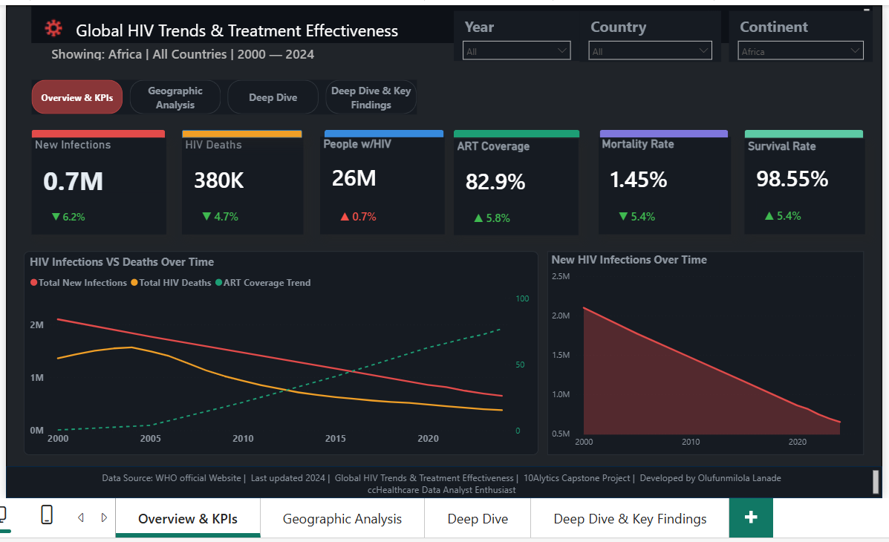

# my-powerbi-who-project
# Global HIV Trends & Treatment Effectiveness Analysis

## Project Overview

This Power BI healthcare analytics project evaluates global HIV burden, treatment access, mortality trends, and public health outcomes using WHO data from 2000–2024.

The dashboard was developed to support evidence-based healthcare decision-making and public health intelligence.

---

## Key Business Questions

- How have HIV infections changed over time?
- Which countries have the highest HIV burden?
- How effective is ART coverage globally?
- What relationship exists between ART coverage and mortality?
- Which countries remain high-risk despite treatment interventions?

---

## Dashboard Preview

---

## Key Insights

- Global HIV infections continue to decline.
- ART coverage has increased substantially.
- Mortality rates have reduced across most regions.
- Africa remains the highest-burden region.
- Higher ART coverage is associated with lower mortality.

---

## Tools Used

- Power BI
- DAX
- Power Query
- Data Modelling
- Healthcare Analytics

---

## Deliverables

### PDF Report

[View Full PDF Report](HIV_PDF_Submission_Report.pdf)

### GitHub Repository

https://github.com/funmilolalanade-ai/my-powerbi-who-project

---

## Author

**Olufunmilola Lanade**

Healthcare Data Analyst Enthusiast

Power BI | SQL | Excel | Tableau | Healthcare Analytics
